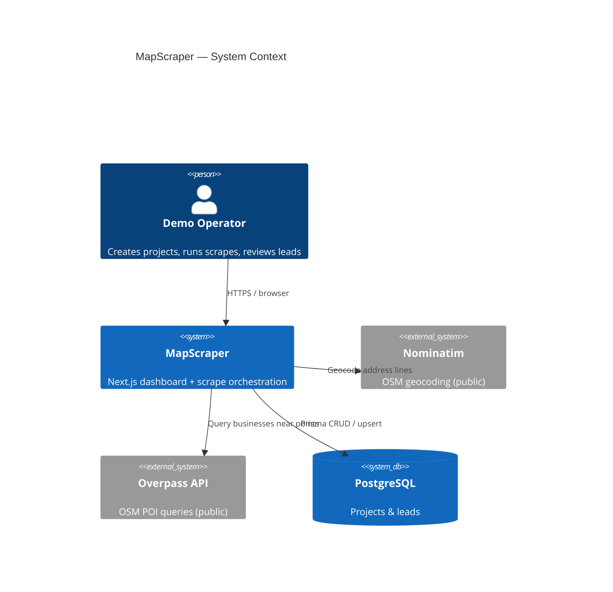
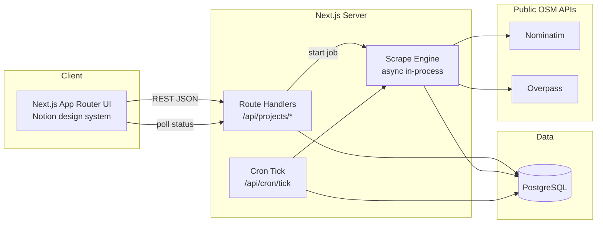
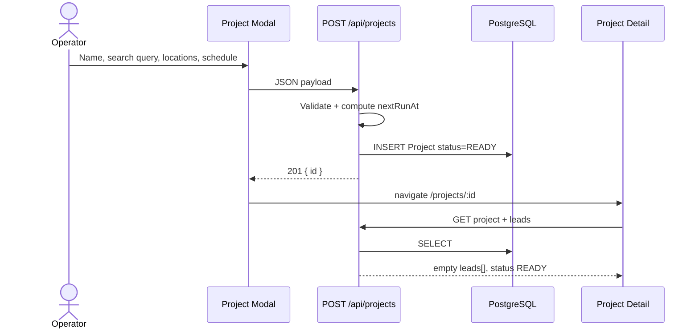
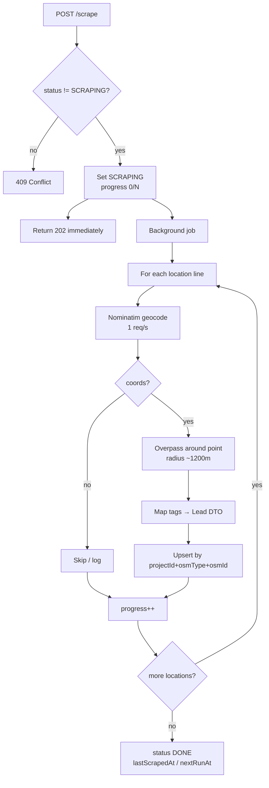
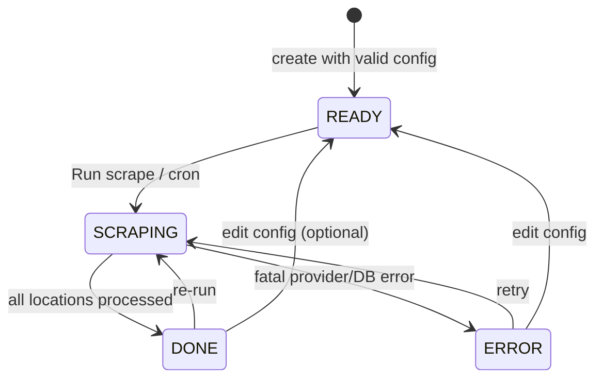
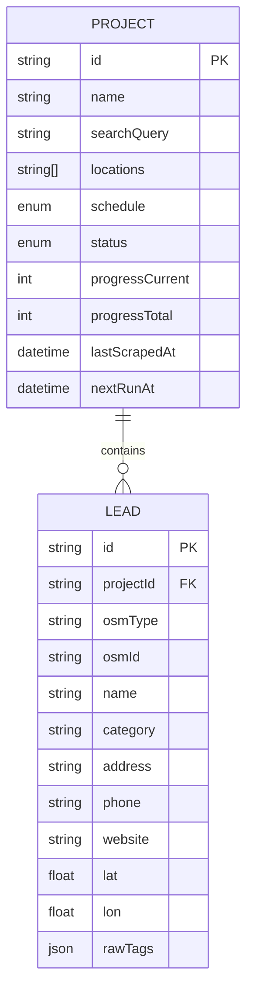
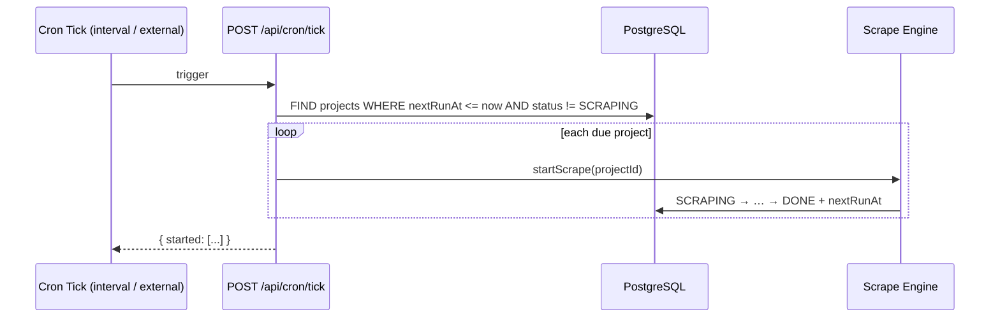
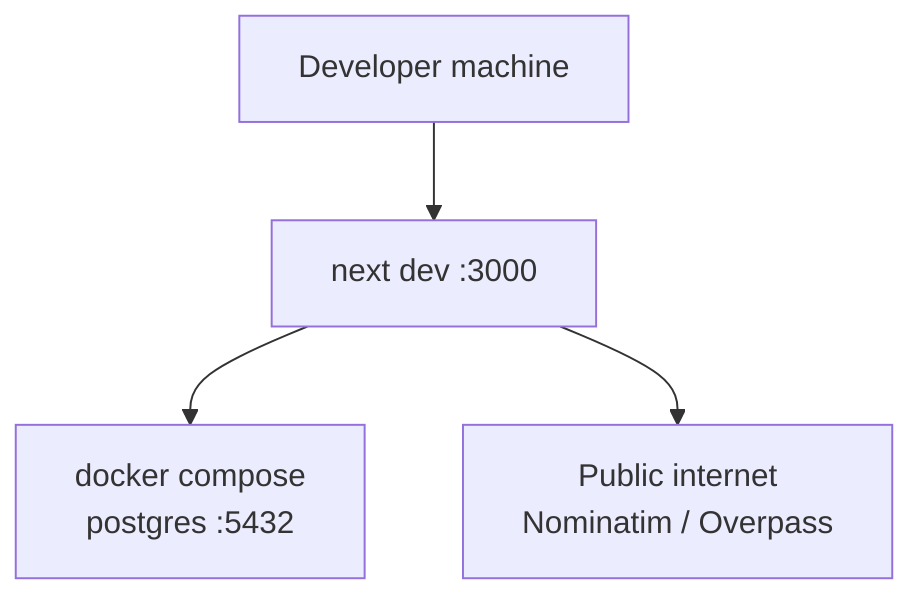

# MapScraper — Architecture

Senior fullstack overview for the demo leadgen scraper. Companion deck: [`architecture.html`](./architecture.html). Spec: [`spec.md`](./spec.md).

---

## 1. System Context

---

## 2. Container View

---

## 3. Request Lifecycle — Create Project

---

## 4. Scrape Pipeline

---

## 5. Status State Machine

---

## 6. Data Model

---

## 7. Scheduling

---

## 8. Key Design Decisions

| Decision | Choice | Rationale |
|----------|--------|-----------|
| Map data source | Nominatim search first, Overpass enrich | Free public APIs; Nominatim is stable when Overpass mirrors rate-limit |
| Job runner | In-process async after 202 | Zero infra for demo; swap for queue later |
| Dedup | Unique `(projectId, osmType, osmId)` | Idempotent re-scrapes / schedules |
| UI | Notion design tokens | Familiar ops UI; dense tables + soft modal |
| ORM | Prisma 5 | Typed schema, fast local migrate |

---

## 9. Deployment Topology (Local Demo)

---

## 10. Extension Points

- Replace in-process jobs with BullMQ / Inngest
- Self-host Nominatim + Overpass for volume
- Add auth + workspace isolation
- Export CSV / webhook to CRM
- Leaflet map of lead pins
